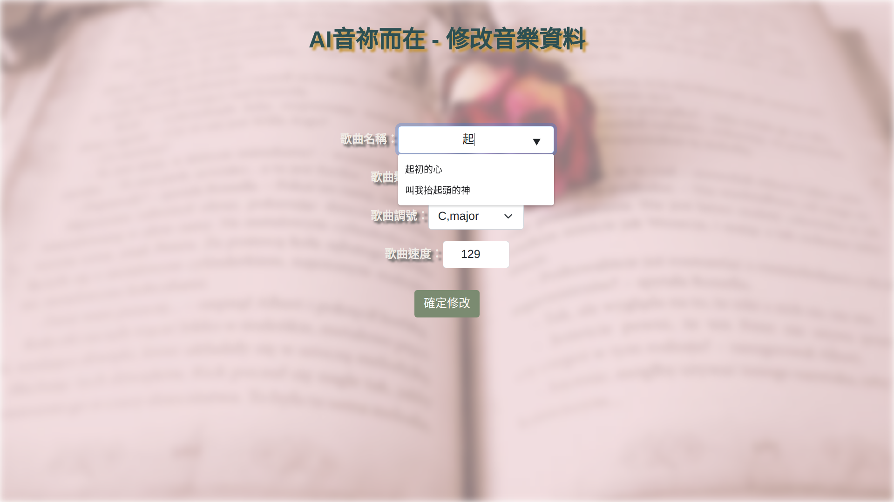

# AI-Music-Player

This is a AI-driven music website, which is one of my school-project.

## Demo

[實際網站](http://hymn-music-player.herokuapp.com/)

- 上傳訓練樣本:

    

- AI模型自動分類:

    

- 更新正確的歌曲參數(AI自動重新訓練):

    

## Technologies

- Architecture: MVC-like, RESTful-API

- Language: Node.js, TypeScript

- Frontend: Vanilla HTML/CSS/JavaScript, Bootstrap

- Backend: Express.js

- Database: MongoDB Atlas(host on cloud)

## Features

1. (呼叫另一位同學寫的API)上傳音檔，訓練AI模型。

2. (呼叫另一位同學寫的API)上傳音檔，給AI自動判斷(曲風、節拍、調性、關鍵字等)。

3. (呼叫另一位同學寫的API)上傳音檔，儲存音檔，並提供音樂串流。

4. 取得AI判斷後的資料，存入此專案的資料庫

5. 依據指定的條件(歌曲數量、曲風、調性、節拍、關鍵字等)篩選出歌曲

6. 產生播放清單(隨機播放順序)

7. 用原生HTML/CSS/JavaScript純手刻的音樂播放器

## Usage

1. setting environment variables in `.env` file:

    ```.env
    PORT=<port>
    MONGODB_URI=<your-mongodb-uri>
    ```

2. install all dependencies version-locked:

    ```bash
    $ npm ci
    ```

3. build the project (compile all `.ts` files into `.js` files):

    ```bash
    $ npm run build
    ```

4. install all dependencies version-locked which are only needed in runtime:

    ```bash
    $ npm ci --production
    ```

5. run the web server:

    ```bash
    $ npm run start
    ```

6. just check the website in your browser: `http://localhost:<port>`
